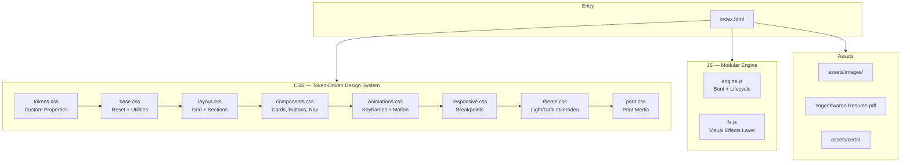
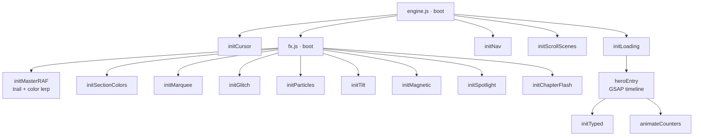
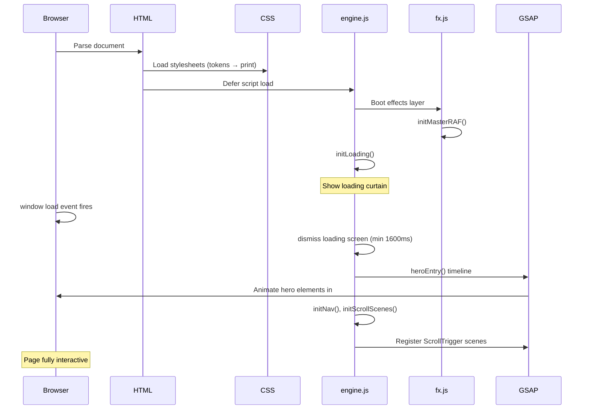
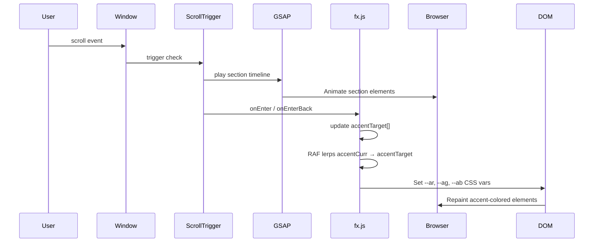
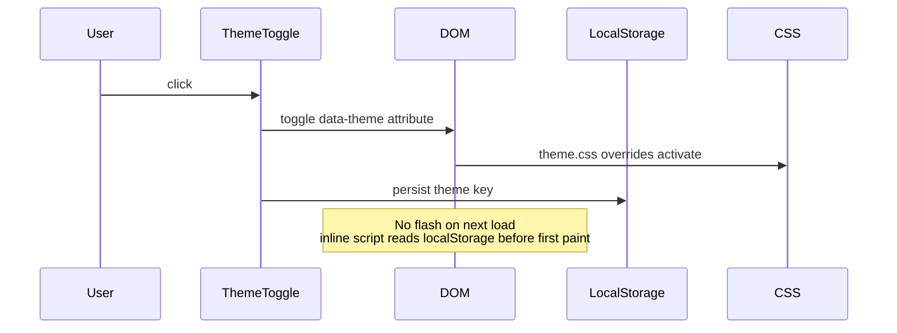

# Design Document: Portfolio Redesign (yoge.dev)

## Overview

This document covers the complete technical redesign of Yogeshwaran M's personal portfolio site
(yoge.dev). The existing site is a single-page, cinematic-narrative experience built with vanilla
HTML/CSS/JS, GSAP 3, ScrollTrigger, Typed.js, and VanillaTilt. The redesign preserves the
"chapter-based story" concept and the dark cinematic aesthetic while overhauling the architecture
for maintainability, performance, and accessibility — replacing the sprawling 25-file CSS split
with a token-driven design system, consolidating two JS files into a single modular engine, and
introducing a lightweight component model backed by clean data contracts.

The goal is not a framework migration; the output is still a zero-dependency static site (pure
HTML + CSS + vanilla JS). The redesign introduces: a single CSS custom-property token layer
(replacing fragmented overrides), a module-pattern JS engine with clear lifecycle phases, an
asset pipeline contract, improved semantic HTML, and a11y compliance for WCAG 2.1 AA.

---

## Architecture

### High-Level Site Structure



### Page Section Flow

```mermaid
graph LR
    LS[Loading Screen] --> H[Hero / Prologue]
    H --> S1[01 · Origin]
    S1 --> M1[Marquee Strip]
    M1 --> S2[02 · Journey]
    S2 --> M2[Marquee Strip]
    M2 --> S3[03 · Quests]
    S3 --> M3[Marquee Strip]
    M3 --> S4[04 · Battles]
    S4 --> M4[Marquee Strip]
    M4 --> S5[05 · Discovery]
    S5 --> M5[Marquee Strip]
    M5 --> S6[06 · Credentials]
    S6 --> M6[Marquee Strip]
    M6 --> S7[07 · Contact]
    S7 --> FT[Footer]
```



### JavaScript Module Dependency Graph



---

## Sequence Diagrams

### Page Load Sequence



### Scroll Interaction Sequence



### Theme Toggle Sequence



---

## Components and Interfaces

### Component 1: Loading Screen

**Purpose**: Full-viewport cinematic entry curtain shown on first paint.

**Interface** (DOM contract):
```typescript
interface LoadingScreen {
  element:  HTMLElement         // #loadingScreen  .loading-screen
  dismiss(): void               // adds .is-done, then .is-hidden after 900ms
  minDuration: 1600             // ms — prevents flash on fast connections
  hardTimeout: 4000             // ms — dismiss even if load stalls
}
```

**Responsibilities**:
- Display brand name letter-by-letter animation
- Animate linear progress bar fill to 100%
- Dispatch `dismiss()` once `window.load` fires (or hard timeout)
- After dismissal, invoke `heroEntry()` to start hero GSAP timeline

---

### Component 2: Navigation

**Purpose**: Fixed top bar with scrollspy, theme toggle, scroll progress bar, and mobile drawer.

**Interface**:
```typescript
interface Navigation {
  // State
  isScrolled: boolean           // adds .is-scrolled when scrollY > 50
  isHidden:   boolean           // adds .is-hidden on fast scroll-down
  activeLink: HTMLAnchorElement | null

  // Methods
  updateScrollspy(): void       // called on scroll; picks section closest to scrollY+110
  openMobileMenu(): void
  closeMobileMenu(): void
  updateProgress(): void        // updates .scroll-progress__fill width %
}

interface NavLink {
  href:  string     // #section-id
  num:   string     // "01"–"07"
  label: string
}
```

**Responsibilities**:
- Scroll-aware transparency (glass-blur when scrolled)
- Scroll-direction hide/show
- Scrollspy via `offsetTop` comparison (no IntersectionObserver)
- Mobile full-panel drawer with staggered link entrance
- Theme toggle: reads/writes `localStorage('yoge-theme')`, sets `data-theme` on `<html>`
- Smooth scroll for all `href="#..."` anchors

---

### Component 3: Hero Section

**Purpose**: Full-viewport opening prologue with portrait, animated name, metrics, and CTAs.

**Interface**:
```typescript
interface HeroSection {
  // Sub-components
  particles: HeroParticles
  badge:     HeroBadge
  metrics:   HeroMetric[]
  typedRole: TypedInstance

  // Lifecycle
  heroEntry(): void             // GSAP master timeline — called after loading dismissed
}

interface HeroMetric {
  count: number     // data-count attribute value
  label: string     // e.g. "Years Coding"
}

interface HeroParticles {
  count: number     // 12 mobile / 25 desktop
  spawn(): void
}
```

**Responsibilities**:
- Cinematic reveal timeline (image mask clip, border, glow, badge, kicker, headline, tagline, metrics, CTA)
- Counter animation via GSAP `data-count`
- Typed.js role typewriter cycling through 5 roles
- Particle field (CSS `pRise` keyframe, spawned by JS)
- Hero parallax on scroll (desktop only)
- Scroll-hint mouse indicator that fades on first scroll

---

### Component 4: Story Sections (Origin, Journey, Quests, Battles, Discovery, Credentials, Contact)

**Purpose**: Seven narrative chapters, each with a scroll-triggered entrance animation.

**Interface**:
```typescript
interface StorySection {
  id:          string             // "origin" | "journey" | "quests" | "battles" | "discovery" | "credentials" | "contact"
  dataSection: number             // 1–7
  accentColor: [number, number, number]  // RGB triplet for section color map
  scrollScene: GSAPTimeline | null
}

interface SectionHeader {
  eyebrow:   string   // "Chapter One" etc.
  title:     string   // "The Origin" etc.
  subtitle:  string
}
```

---

### Component 5: Timeline (Journey Section)

**Purpose**: Vertical alternating timeline with animated progress line and entry cards.

**Interface**:
```typescript
interface Timeline {
  entries: TimelineEntry[]
  progressEl: HTMLElement   // .timeline__progress — height animated by ScrollTrigger scrub
}

interface TimelineEntry {
  period:   string   // "2019 — 2020"
  status:   "Completed" | "Internship" | "Current"
  title:    string
  place:    string
  score?:   string   // CGPA or percentage
  actions?: { label: string; href: string; download?: boolean }[]
}
```

---

### Component 6: Project Cards

**Purpose**: Showcase hero card + grid of supplementary project cards.

**Interface**:
```typescript
interface ProjectHero {
  year:     string
  tag:      string
  name:     string
  hook:     string
  body:     string
  tech:     string[]
  wins:     string[]
  actions:  { label: string; href: string; icon?: string }[]
}

interface ProjectCard {
  icon:    string     // Font Awesome class
  year:    string
  tag:     string
  title:   string
  desc:    string
  tech:    string[]
  link:    { label: string; href: string }
}
```

---

### Component 7: Battle Cards (Hackathons)

**Interface**:
```typescript
interface BattleFeatured {
  icon:    string
  badges:  { label: string; variant: string }[]
  title:   string
  org:     string
  desc:    string
  date:    string
  actions: { label: string; href: string; download?: boolean }[]
}

interface BattleCard {
  icon:  string
  tags:  string[]
  title: string
  org:   string
  desc:  string
  date?: string
  certActions?: { view: string; download: string }
}
```

---

### Component 8: Research Paper (Discovery Section)

**Interface**:
```typescript
interface ResearchPaper {
  type:     string          // "Conference Paper"
  paperId:  string          // "ICISD26-408"
  title:    string
  venue:    { name: string; detail: string }
  abstract: string
  keywords: string[]
  results:  ResultMetric[]
  authors:  string
  affiliation: string
  flags:    string[]
}

interface ResultMetric {
  label:    string   // "Accuracy" | "F1-Score" | "ROC-AUC"
  value:    number
  unit:     string
  decimal?: string
}
```

---

### Component 9: Credentials (Skills + Certifications)

**Interface**:
```typescript
interface SkillGroup {
  icon:   string
  label:  string
  skills: SkillRow[]
}

interface SkillRow {
  name:  string
  width: number    // 0–100 percentage
}

interface CertItem {
  icon:     string
  iconColor: string
  title:    string
  issuer:   string
  file:     string   // href for view/download
}
```

---

### Component 10: Cursor + Effects Layer

**Interface**:
```typescript
interface CursorSystem {
  dot:  HTMLElement     // .cursor__dot
  ring: HTMLElement     // .cursor__ring
  // Tracks pointer on mousemove, hides on coarse pointer (touch)
  initHoverTargets(selectors: string): void
}

interface AccentColorSystem {
  accentCurr:   [number, number, number]   // live RGB
  accentTarget: [number, number, number]   // target RGB (set by section scroll)
  sectionMap:   Record<string, [number, number, number]>
  // Lerps accentCurr → accentTarget each RAF frame
  // Writes --ar, --ag, --ab to :root
}

interface TrailSystem {
  dots:  TrailDot[]    // 8 dots (desktop only)
  count: 8
}
```

---

## Data Models

### Design Token Model

```typescript
// tokens.css — all values as CSS custom properties
interface DesignTokens {
  // Colors
  bgDarkest:  "#07070d"
  bgDark:     "#0a0a14"
  bgMid:      "#13131f"
  bgLight:    "#1a1a2a"
  bgCard:     "#161622"
  bgCardHover:"#1e1e30"

  // Accent palette
  accentCyan:   "#00e5ff"
  accentPurple: "#a855f7"
  accentPink:   "#f472b6"
  accentGreen:  "#22d3ee"
  accentAmber:  "#fbbf24"

  // Typography
  textBright:    "#ffffff"
  textPrimary:   "#f1f5f9"
  textSecondary: "#94a3b8"
  textMuted:     "#64748b"
  textDim:       "#475569"

  // Fonts
  fontDisplay: "'Cormorant Garamond', Georgia, serif"
  fontBody:    "'Inter', system-ui, sans-serif"
  fontMono:    "'JetBrains Mono', 'Fira Code', monospace"

  // Easing
  easeOutExpo:    "cubic-bezier(0.16, 1, 0.3, 1)"
  easeOutQuart:   "cubic-bezier(0.25, 1, 0.5, 1)"
  easeInOutCirc:  "cubic-bezier(0.85, 0, 0.15, 1)"

  // Fluid spacing (clamp-based)
  space2xs: "clamp(4px, 0.5vw, 8px)"
  spaceXs:  "clamp(8px, 1vw, 12px)"
  spaceSm:  "clamp(10px, 1.5vw, 16px)"
  spaceMd:  "clamp(16px, 2vw, 24px)"
  spaceLg:  "clamp(20px, 3vw, 32px)"
  spaceXl:  "clamp(28px, 4vw, 48px)"
  space2xl: "clamp(40px, 6vw, 80px)"
  space3xl: "clamp(56px, 9vw, 140px)"
  sectionPy:   "clamp(56px, 9vw, 140px)"
  containerPx: "clamp(16px, 5vw, 80px)"
  navHeight:   "70px"
}
```

**Validation Rules**:
- All color values must be valid hex or `rgb()`
- All `clamp()` values: min ≤ preferred ≤ max
- Token names use `--kebab-case` convention
- Dynamic accent vars (`--ar`, `--ag`, `--ab`) are integers 0–255 set by JS at runtime

---

### Section Color Map Model

```typescript
const SECTION_COLOR_MAP: Record<string, [number, number, number]> = {
  prologue:    [102, 231, 242],   // cyan
  origin:      [102, 231, 242],   // cyan
  journey:     [154, 140, 255],   // soft purple
  quests:      [168,  85, 247],   // vivid purple
  battles:     [ 16, 185, 129],   // emerald
  discovery:   [102, 231, 242],   // cyan
  credentials: [244, 199, 107],   // amber
  contact:     [102, 231, 242],   // cyan
}
```

---

### CSS File Architecture Model

```typescript
// Redesigned file structure — replaces 25-file split
interface CSSArchitecture {
  "tokens.css":     "Design tokens — all CSS custom properties. Loaded first."
  "base.css":       "CSS reset, html/body defaults, selection, scrollbar hide, utility classes"
  "layout.css":     "Container, story-section, section-header, section-bg orbs"
  "components.css": "All UI components: nav, hero, cards, timeline, skills, certs, contact, footer, modal, loading, cursor"
  "animations.css": "All @keyframes + animation utility classes"
  "responsive.css": "Breakpoints: ≤768px mobile, ≤1024px tablet, ≥1440px wide, ≥2560px 4K"
  "theme.css":      "data-theme=light overrides"
  "print.css":      "Print styles"
}
```

---

## Algorithmic Pseudocode

### Main Boot Algorithm

```pascal
ALGORITHM boot()
INPUT: DOMContentLoaded or immediate call
OUTPUT: fully initialised page

BEGIN
  /* Phase 0 — apply saved theme before first paint */
  theme ← localStorage.getItem('yoge-theme')
  IF theme IS NOT NULL THEN
    document.documentElement.setAttribute('data-theme', theme)
  END IF

  /* Phase 1 — Effects layer (no GSAP dependency) */
  fx.boot()
    CALL initMasterRAF()       /* single RAF: trail dots + accent lerp */
    CALL initSectionColors()   /* ScrollTrigger accent map */
    CALL initSpotlight()       /* hero mousemove → CSS vars */
    CALL initMarquee()         /* inject marquee strips */
    CALL initGlitch()          /* IntersectionObserver on eyebrows */
    CALL initParticles()       /* CSS keyframe particles */
    CALL initTilt()            /* 3D card tilt (desktop only) */
    CALL initMagnetic()        /* magnetic CTA buttons (desktop only) */
    CALL initChapterFlash()    /* full-screen chapter overlay */

  /* Phase 2 — Engine layer */
  engine.boot()
    CALL initCursor()          /* custom cursor (desktop only) */
    CALL initLoading()         /* loading screen dismiss logic */
    CALL initNav()             /* nav scrollspy + mobile menu */
    CALL initScrollScenes()    /* GSAP scroll animations */

  /* Phase 3 — heroEntry() called by initLoading() after dismiss */
END
```

**Preconditions**:
- DOM is fully parsed
- GSAP + ScrollTrigger loaded before engine.js
- `tokens.css` loaded first so CSS vars are available

**Postconditions**:
- All interactive elements respond to pointer events
- All scroll animations are registered with ScrollTrigger
- Accent color lerp RAF is running

---

### Loading Screen Dismiss Algorithm

```pascal
ALGORITHM initLoading()
INPUT: window load event, MIN = 1600ms, HARD_TIMEOUT = 4000ms
OUTPUT: loading screen hidden, heroEntry() invoked

BEGIN
  screen ← document.getElementById('loadingScreen')
  t0     ← Date.now()

  PROCEDURE dismiss()
    IF screen.dataset.done EXISTS THEN RETURN END IF
    screen.dataset.done ← '1'
    screen.classList.add('is-done')
    
    /* Wait for curtain-close animation */
    WAIT 900ms
    screen.classList.add('is-hidden')
    CALL heroEntry()
  END PROCEDURE

  /* Normal path: wait for full load, then honour minimum duration */
  window.addEventListener('load', () =>
    setTimeout(dismiss, MAX(0, MIN - (Date.now() - t0)))
  )

  /* Safety net: force dismiss after hard timeout */
  setTimeout(dismiss, HARD_TIMEOUT)
END

ASSERT: dismiss() runs exactly once regardless of path taken
```

**Preconditions**:
- `loadingScreen` element exists in DOM
- `heroEntry()` is defined and GSAP is loaded

**Postconditions**:
- Loading screen has `.is-hidden` class
- `heroEntry()` has been called exactly once
- `screen.dataset.done` is set to prevent double-invocation

**Loop Invariants**: N/A (no loops)

---

### Hero Entry Animation Algorithm

```pascal
ALGORITHM heroEntry()
INPUT: none (GSAP and DOM elements must be available)
OUTPUT: hero section animated to visible state

BEGIN
  tl ← gsap.timeline({ defaults: { ease: 'power3.out' } })

  /* Image reveal sequence */
  tl.fromTo('.hero-image__mask',   { clipPath: 'inset(100% 0 0 0)' },
                                   { clipPath: 'inset(0% 0 0 0)', duration: 1.2 }, t=0)
  tl.fromTo('.hero-image__img',    { scale: 1.1 }, { scale: 1, duration: 1.6 }, t=0)
  tl.fromTo('.hero-image__border', { opacity: 0 }, { opacity: 0.6, duration: 1.0 }, t=0.5)
  tl.fromTo('.hero-image__glow',   { opacity: 0 }, { opacity: 1,   duration: 1.2 }, t=0.6)
  tl.fromTo('.hero-badge',         { opacity: 0, y: 16 }, { opacity: 1, y: 0, duration: 0.8 }, t=1.0)

  /* Text content sequence */
  tl.fromTo('.hero-kicker',   { opacity: 0, x: -24 }, { opacity: 1, x: 0, duration: 0.8 }, t=0.4)
  tl.fromTo('.hero-headline', { opacity: 0, y: 30  }, { opacity: 1, y: 0, duration: 0.9 }, t=0.55)
  tl.fromTo('.hero-tagline',  { opacity: 0, y: 20  }, { opacity: 1, y: 0, duration: 0.8 }, t=0.85)
  tl.fromTo('.hero-metrics',  { opacity: 0, y: 18  }, { opacity: 1, y: 0, duration: 0.8 }, t=1.0)
  tl.fromTo('.hero-cta',      { opacity: 0, y: 18  }, { opacity: 1, y: 0, duration: 0.8 }, t=1.15)
  tl.fromTo('.hero-scroll-hint', { opacity: 0 },      { opacity: 1, duration: 0.8 },       t=1.7)

  /* Counter animation — runs in parallel with metrics reveal */
  FOR each element IN $$('[data-count]') DO
    end ← parseInt(element.dataset.count)
    obj ← { v: 0 }
    tl.to(obj, { v: end, duration: 2, ease: 'power2.out',
      onUpdate: () => element.textContent ← Math.round(obj.v) }, t=1.0)
  END FOR

  /* Desktop parallax on scroll */
  IF NOT tablet() THEN
    REGISTER ScrollTrigger parallax on .hero-image__frame
    REGISTER ScrollTrigger parallax on .hero-kicker, .hero-headline, .hero-tagline
  END IF

  /* Scroll hint fade out */
  REGISTER ScrollTrigger scrub fade for .hero-scroll-hint
    start: '5% top', end: '18% top'
    onLeave:     add .is-scroll-hidden
    onEnterBack: remove .is-scroll-hidden

  /* Start Typed.js after entry is in progress */
  CALL initTyped()
END

ASSERT: all hero elements are visible after timeline completes
ASSERT: scroll hint disappears when user scrolls past 18% of hero
```

**Preconditions**:
- Loading screen is fully dismissed
- GSAP and ScrollTrigger are initialised
- All `.hero-*` DOM elements exist

**Postconditions**:
- Hero section elements are fully visible (`opacity: 1`)
- Counter elements display their final `data-count` values
- ScrollTrigger parallax registered on desktop

---

### Scroll Scene Registration Algorithm

```pascal
ALGORITHM initScrollScenes()
INPUT: none
OUTPUT: all section scroll animations registered with ScrollTrigger

BEGIN
  /* Set global defaults — once:true prevents re-animation on scroll-back */
  ScrollTrigger.defaults({ once: true, fastScrollEnd: true, preventOverlaps: true })

  /* Section headers — wipe reveal */
  FOR each el IN $$('.section-title') DO
    IF el.getBoundingClientRect().top < window.innerHeight THEN
      gsap.set(el, { clipPath: 'inset(0 0% 0 0)', opacity: 1 })
      CONTINUE
    END IF
    REGISTER wipe animation: clipPath from 'inset(0 100% 0 0)' to 'inset(0 0% 0 0)'
  END FOR

  /* Origin section */
  FOR each block IN $$('.narrative-block') DO
    REGISTER fromTo: opacity 0→1, x -50→0 with stagger
  END FOR
  FOR each card IN $$('.origin-card') DO
    REGISTER fromTo: opacity 0→1, y 70→0, rotateX 25→0, scale 0.88→1 with stagger
  END FOR

  /* Journey — timeline progress line scrub */
  REGISTER ScrollTrigger scrub: .timeline__progress height 0%→100%
  FOR each entry IN $$('.timeline-entry') DO
    fromX ← IF index IS EVEN THEN -65 ELSE 65
    REGISTER fromTo: opacity 0→1, x fromX→0, scale 0.94→1
  END FOR

  /* Quests */
  REGISTER fromTo .project-hero: opacity 0→1, scale 0.78→1, y 60→0
  FOR each card IN $$('.project-card') DO
    angle ← IF index IS EVEN THEN -6 ELSE 6
    REGISTER fromTo: opacity 0→1, y 80→0, rotation angle→0, scale 0.85→1
  END FOR

  /* Battles */
  REGISTER fromTo .battle-featured: opacity 0→1, x -80→0, scale 0.95→1
  FOR each card IN $$('.battle-card') DO
    REGISTER fromTo: opacity 0→1, x 70→0, scale 0.94→1 with stagger
  END FOR

  /* Discovery */
  REGISTER fromTo .research-paper: opacity 0→1, y 80→0, scale 0.96→1
  FOR each block-selector IN paper sub-elements DO
    REGISTER fromTo: opacity 0→1, y 30→0 with stagger offset
  END FOR

  /* Credentials */
  REGISTER fromTo .skills-panel:  opacity 0→1, x -80→0, scale 0.96→1
  REGISTER fromTo .certs-panel:   opacity 0→1, y -60→0, scale 0.96→1
  FOR each cert IN $$('.cert-item') DO
    REGISTER fromTo: opacity 0→1, x 55→0, scale 0.92→1 with stagger
  END FOR

  /* Contact */
  FOR each card IN $$('.contact-card') DO
    REGISTER fromTo: opacity 0→1, y 50→0, scale 0.95→1 with stagger
  END FOR

  /* Desktop orb + card parallax (non-mobile only) */
  IF NOT mobile() THEN
    FOR each orb IN $$('.section-bg__orb') DO
      REGISTER scrub parallax: yPercent alternating -55/-35
    END FOR
    FOR each card IN $$('.project-card, .battle-card, .origin-card') DO
      REGISTER scrub parallax: yPercent alternating -4/-8
    END FOR
  END IF
END

INVARIANT: elements not yet in viewport remain at opacity:0
INVARIANT: elements already in viewport on page refresh are set to final state immediately
```

---

### Accent Color Lerp Algorithm (Single RAF)

```pascal
ALGORITHM initMasterRAF()
INPUT: none
OUTPUT: continuous RAF loop animating cursor trail and accent color

CONSTANTS:
  TRAIL_COUNT = 8
  LERP_SPEED  = 0.03   /* accent lerp factor */

BEGIN
  isCoarse ← window.matchMedia('(pointer:coarse)').matches

  /* Build cursor trail dots (desktop only) */
  IF NOT isCoarse THEN
    FOR i FROM 0 TO TRAIL_COUNT - 1 DO
      dot ← create div with size MAX(2, 6 - i * 0.5)px
      trailDots[i] ← { el: dot, x: -500, y: -500 }
    END FOR
  END IF

  FUNCTION tick()
    /* Trail animation */
    IF NOT isCoarse THEN
      FOR i FROM 0 TO TRAIL_COUNT - 1 DO
        ASSERT 0 ≤ i < TRAIL_COUNT
        speed ← 0.40 - i * 0.028
        prev  ← IF i = 0 THEN { x: mouseX, y: mouseY } ELSE trailDots[i-1]
        trailDots[i].x += (prev.x - trailDots[i].x) * speed
        trailDots[i].y += (prev.y - trailDots[i].y) * speed
        WRITE transform and rgba color to dot element
      END FOR
    END IF

    /* Accent color lerp */
    changed ← false
    FOR channel FROM 0 TO 2 DO
      delta ← accentTarget[channel] - accentCurr[channel]
      IF |delta| > 0.3 THEN
        accentCurr[channel] += delta * LERP_SPEED
        changed ← true
      END IF
    END FOR
    IF changed THEN
      SET --ar, --ag, --ab on :root to Math.round(accentCurr)
    END IF

    requestAnimationFrame(tick)
  END FUNCTION

  requestAnimationFrame(tick)
END

LOOP INVARIANT: All trail dot positions are interpolated toward their leader
LOOP INVARIANT: accentCurr[i] converges monotonically toward accentTarget[i]
POSTCONDITION:  --ar, --ag, --ab always reflect current accentCurr values
```

---

### Navigation Scrollspy Algorithm

```pascal
ALGORITHM updateScrollspy()
INPUT: window.scrollY, array of .story-section[id] elements
OUTPUT: correct .nav-link gets .is-active class

BEGIN
  scrollY ← window.scrollY + NAV_HEIGHT + 40   /* 110px effective offset */
  current ← sections[0]                        /* fallback to first */

  FOR each section IN sections DO
    IF section.offsetTop ≤ scrollY THEN
      current ← section
    END IF
  END FOR
  /* Post-loop: current = last section whose top is above scroll position */

  REMOVE .is-active from all .nav-link
  IF current EXISTS THEN
    linkMap[current.id]?.classList.add('is-active')
  END IF
END

LOOP INVARIANT: current always holds the section with the largest offsetTop ≤ scrollY
POSTCONDITION:  Exactly zero or one .nav-link has .is-active
```

---

### Glitch Scramble Algorithm

```pascal
ALGORITHM scrambleText(element)
INPUT: element — a .section-eyebrow DOM element
OUTPUT: text scrambles character-by-character then restores

CONSTANTS:
  CHARSET = 'ABCDEFGHIJKLMNOPQRSTUVWXYZ0123456789'
  TICK_MS = 28

BEGIN
  orig   ← element.getAttribute('data-orig') OR element.textContent.trim()
  element.setAttribute('data-orig', orig)
  f      ← 0
  total  ← orig.length × 2.8

  iv ← setInterval(() =>
    revealed ← Math.floor((f / total) × orig.length)
    element.textContent ← orig.split('').map((char, i) =>
      IF char = ' ' OR char = '·' THEN RETURN char   /* preserve spaces */
      IF i < revealed THEN RETURN char                /* lock in revealed chars */
      RETURN CHARSET[random() × CHARSET.length | 0]  /* scramble rest */
    ).join('')
    f++
    IF f ≥ total THEN
      element.textContent ← orig                     /* guaranteed restoration */
      clearInterval(iv)
    END IF
  , TICK_MS)

  RETURN iv  /* caller must clear on mouseleave */
END

LOOP INVARIANT: chars at index < revealed are always the original characters
POSTCONDITION:  element.textContent = orig when interval completes
```

---

## Key Functions with Formal Specifications

### `heroEntry()`

```typescript
function heroEntry(): void
```

**Preconditions**:
- `window.gsap` and `window.ScrollTrigger` are defined
- Loading screen has `.is-hidden` class
- All `.hero-*` elements exist in the DOM

**Postconditions**:
- All hero elements are animated to `opacity: 1` with correct positions
- Counter elements show their final `data-count` values
- `initTyped()` has been called

**Loop Invariants**: N/A

---

### `initNav()`

```typescript
function initNav(): void
```

**Preconditions**:
- `#mainNav`, `#menuToggle`, `#mobileMenu` elements exist
- All `.nav-link[href^="#"]` point to sections with matching IDs

**Postconditions**:
- Scroll listener updates `.is-scrolled` on nav
- Scroll listener updates progress bar width
- Mobile menu opens/closes correctly
- Clicking a nav link smooth-scrolls to target section

**Loop Invariants**: N/A

---

### `initScrollScenes()`

```typescript
function initScrollScenes(): void
```

**Preconditions**:
- `ScrollTrigger` is registered with GSAP
- All `.story-section[id]` elements exist

**Postconditions**:
- Every non-hero element with an entrance animation has a registered ScrollTrigger
- `ScrollTrigger.defaults({ once: true })` ensures animations fire once
- Elements already in viewport on load are set to final state immediately

---

### `initMasterRAF()`

```typescript
function initMasterRAF(): void
```

**Preconditions**:
- `document.body` exists (for trail dot injection)

**Postconditions**:
- A single continuous `requestAnimationFrame` loop is running
- `--ar`, `--ag`, `--ab` CSS vars on `:root` are kept in sync with `accentCurr`
- On coarse-pointer devices: no trail dots are created

---

### `updateScrollspy()`

```typescript
function updateScrollspy(): void
```

**Preconditions**:
- `sections` array is non-empty
- `linkMap` maps section IDs to their corresponding `.nav-link` elements

**Postconditions**:
- Exactly one (or zero) `.nav-link` has `.is-active`
- The active link corresponds to the section whose top is closest to (but ≤) `scrollY + 110`

---

### `initSkillBars()`

```typescript
function initSkillBars(): void
```

**Preconditions**:
- Each `.skill-bar__fill` has a `data-width` attribute containing a valid integer 0–100

**Postconditions**:
- Each bar starts at `width: 0%` and animates to `data-width%` when scrolled into view
- Each `IntersectionObserver` disconnects after firing once

---

## Example Usage

### Initialising the Engine

```javascript
// engine.js — boot sequence

document.readyState === 'loading'
  ? document.addEventListener('DOMContentLoaded', boot)
  : boot();

function boot() {
  applyStoredTheme();    // inline before first paint in <head>
  fx.boot();             // effects layer (no GSAP dependency)
  initCursor();
  initLoading();         // calls heroEntry() internally after dismiss
  initNav();
  initScrollScenes();
}
```

### Adding a New Section

```javascript
// 1. Add section to SECTION_COLOR_MAP in fx.js
const SECTION_COLOR_MAP = {
  // ...existing sections...
  portfolio: [244, 114, 182],  // pink accent
};

// 2. Add HTML — section must have id matching the map key
// <section class="story-section portfolio-section" id="portfolio" data-section="8">

// 3. Add ScrollTrigger scene in initScrollScenes()
gsap.fromTo('.portfolio-card',
  { opacity: 0, y: 60, scale: 0.9 },
  { opacity: 1, y: 0,  scale: 1, stagger: 0.12, ease: 'power3.out',
    scrollTrigger: { trigger: '.portfolio-grid', start: 'top 92%', once: true } }
);

// 4. Add nav link
// <a href="#portfolio" class="nav-link">
//   <span class="nav-link__num">08</span><span>Portfolio</span>
// </a>
```

### Theme Toggle Implementation

```javascript
function initTheme() {
  const toggle = document.getElementById('themeToggle');
  const html   = document.documentElement;

  toggle.addEventListener('click', () => {
    const next = html.getAttribute('data-theme') === 'light' ? 'dark' : 'light';
    html.setAttribute('data-theme', next);
    localStorage.setItem('yoge-theme', next);
  });
}

// In <head> — runs before first paint to prevent FOUC:
// <script>(function(){
//   var t = localStorage.getItem('yoge-theme');
//   if (t) document.documentElement.setAttribute('data-theme', t);
// })();</script>
```

### Result Card Animation

```javascript
// initResultCards() — robust bar + counter for .result-card
function initResultCard(card) {
  const fill  = card.querySelector('.result-card__fill');
  const numEl = card.querySelector('.result-card__number');
  if (!fill || !numEl) return;

  const targetW = parseFloat((fill.getAttribute('style') || '').match(/width:\s*([\d.]+)%/)?.[1] || '99');
  const targetN = parseFloat(numEl.dataset.count || numEl.textContent.replace(/[^\d.]/g, '')) || 99;
  const isDecimal = targetN % 1 !== 0;

  fill.removeAttribute('style');  // GSAP owns width from here

  let fired = false;
  const obs = new IntersectionObserver(entries => {
    if (!entries[0].isIntersecting || fired) return;
    fired = true; obs.disconnect();

    requestAnimationFrame(() => {
      gsap.fromTo(fill, { width: '0%' }, { width: `${targetW}%`, duration: 1.8, ease: 'power3.out' });
      const obj = { v: 0 };
      gsap.to(obj, { v: targetN, duration: 1.8, ease: 'power3.out',
        onUpdate() { numEl.textContent = isDecimal ? obj.v.toFixed(2) : Math.round(obj.v); }
      });
    });
  }, { threshold: 0.05 });
  obs.observe(card);
}
```

---

## Correctness Properties

*A property is a characteristic or behavior that should hold true across all valid executions of a system — essentially, a formal statement about what the system should do. Properties serve as the bridge between human-readable specifications and machine-verifiable correctness guarantees.*

### Property 1: Single Animation Entry

Every scroll-triggered element animates from hidden to visible exactly once (`ScrollTrigger.defaults({ once: true })`). For any set of scroll positions visited in any order, no element persists at `opacity: 0` after its trigger fires, and no element's entrance animation plays more than once.

**Validates: Requirements 6.1**

---

### Property 2: Visibility Guarantee for In-Viewport Elements

For any page load state where one or more `.section-title` or `[data-reveal]` elements are already within the viewport, those elements are immediately set to their final visible state via `gsap.set()` — never left hidden awaiting a scroll event that will not fire.

**Validates: Requirements 6.2**

---

### Property 3: Loading Dismissal Idempotency

For any sequence of `dismiss()` calls (one or more), `heroEntry()` is invoked exactly once. The guard `screen.dataset.done` is set atomically before any side effects, so all subsequent calls return immediately without invoking `heroEntry()` again.

**Validates: Requirements 3.5, 3.6**

---

### Property 4: Accent Color Convergence

For all valid RGB start values `accentCurr ∈ [0,255]³` and target values `accentTarget ∈ [0,255]³`, the RAF lerp loop with factor `0.03` and termination threshold `|delta| ≤ 0.3` converges `accentCurr[i]` to within `0.3` of `accentTarget[i]` for all three channels within 500 animation frames.

**Validates: Requirements 7.2, 7.3, 7.4**

---

### Property 5: Scrollspy At-Most-One-Active Invariant

For any scroll position `scrollY` and any collection of story sections with distinct `offsetTop` values, the `updateScrollspy()` function produces a state where exactly zero or one `.nav-link` carries `.is-active`. The active link, when present, always corresponds to the deepest section whose `offsetTop` is ≤ `scrollY + 110`.

**Validates: Requirements 5.4, 5.5**

---

### Property 6: Theme Toggle Round-Trip

For any initial `data-theme` value, toggling the theme twice returns `<html data-theme>` to its original value. After each toggle, `localStorage.getItem('yoge-theme')` returns the currently active theme.

**Validates: Requirements 5.9, 5.10, 13.1, 13.2**

---

### Property 7: Mobile Coarse-Pointer Guard

On any device where `window.matchMedia('(pointer:coarse)').matches` is `true`, cursor dot/ring elements are not created, the trail RAF path is skipped, and tilt/magnetic effects are not initialised — for any combination of viewport size and user agent that reports a coarse pointer.

**Validates: Requirements 8.3**

---

### Property 8: Reduced Motion Visibility

For any `[data-reveal]` element in the DOM, when `prefers-reduced-motion: reduce` is active, that element has `opacity: 1` and `transform: none` regardless of scroll position.

**Validates: Requirements 12.1, 12.2**

---

### Property 9: Skill Bar Observer Teardown

For any number of `.skill-bar__fill` elements on the page, each element's `IntersectionObserver` calls `observer.disconnect()` after its first intersection event. No skill bar animates more than once per page load, regardless of how many times the element enters or leaves the viewport.

**Validates: Requirements 10.1, 10.2, 10.3**

---

### Property 10: Glitch Restoration Guarantee

For any `.section-eyebrow` element with any `textContent`, the scramble `setInterval` always restores `element.textContent` to the original string `orig` when `f ≥ total`. Additionally, for any frame `f`, all characters at index `< Math.floor((f / total) × orig.length)` are the original characters — never scrambled characters.

**Validates: Requirements 9.3, 9.4, 9.6**

---

### Property 11: Scroll Progress Bar Accuracy

For any `scrollY` value and any page height, the scroll progress bar width percentage equals `scrollY / (documentHeight − viewportHeight) × 100`, clamped to `[0, 100]`. This holds for all valid combinations of viewport height and document height.

**Validates: Requirements 5.3**

---

### Property 12: clamp Token Validity

For every `clamp(min, preferred, max)` expression in `tokens.css`, the mathematical constraint `min ≤ preferred ≤ max` holds when all three operands are evaluated at any viewport width.

**Validates: Requirements 1.4**

---

### Property 13: Timeline Entry Alternating Entrance Direction

For any index `i` of a `.timeline-entry` element, the initial `x` offset for its entrance animation equals `−65` when `i` is even and `+65` when `i` is odd. This holds for any number of timeline entries.

**Validates: Requirements 6.4**

---

### Property 14: Counter Animation Completeness

For any `[data-count]` element with a non-negative integer `data-count` attribute, the hero entry timeline animates the element's displayed text from `0` to exactly the `data-count` value by the time the animation completes.

**Validates: Requirements 4.3**

---

## Error Handling

### Error Scenario 1: Hero Image Missing

**Condition**: `image.jpg` returns a 404  
**Response**: `onerror` inline handler swaps `src` to `assets/hero-portrait.svg`  
**Recovery**: SVG portrait renders; layout is unaffected

### Error Scenario 2: GSAP / ScrollTrigger Not Loaded

**Condition**: CDN unreachable; `window.gsap` is undefined  
**Response**: `heroEntry()` call throws; loading screen dismiss still runs  
**Recovery**: Page is readable but unanimated. Mitigation: add `typeof gsap !== 'undefined'` guard in `heroEntry()` and fall back to adding `.is-revealed` classes directly.

### Error Scenario 3: localStorage Unavailable (Private Browsing)

**Condition**: `localStorage.getItem` / `setItem` throws  
**Response**: Theme inline script wraps in `try/catch`; defaults to dark theme  
**Recovery**: Theme toggle still works for current session via DOM attribute

### Error Scenario 4: ScrollTrigger Timing on Fast Scroll

**Condition**: User scrolls past multiple sections before ScrollTrigger fires  
**Response**: `fastScrollEnd: true` and `preventOverlaps: true` in defaults ensure queued animations still play  
**Recovery**: `once: true` means every animation fires eventually, never getting stuck at `opacity: 0`

### Error Scenario 5: Typed.js Not Loaded

**Condition**: `window.Typed` is undefined  
**Response**: `initTyped()` returns early (`if (!el || typeof Typed === 'undefined') return`)  
**Recovery**: The `#typed-role` element shows empty string; kicker text area is blank but layout holds

---

## Testing Strategy

### Unit Testing Approach

Test pure functions in isolation with a DOM mock (e.g., jsdom):

- `updateScrollspy()`: given a fixed `scrollY` and a set of section `offsetTop` values, assert the correct section ID is active.
- `dismiss()` idempotency: call twice, assert `heroEntry()` mock is invoked exactly once.
- `scrambleText()`: after interval completes, assert `element.textContent === originalText`.
- Accent lerp: after N ticks, assert `accentCurr` is within 0.3 of `accentTarget` for all channels.
- `initSkillBars()`: assert each observer disconnects after first intersection.

### Property-Based Testing Approach

**Property Test Library**: fast-check

```javascript
// Property: scrollspy always sets exactly 0 or 1 active link
fc.assert(fc.property(
  fc.array(fc.integer({ min: 0, max: 5000 }), { minLength: 1, maxLength: 10 }),
  fc.integer({ min: 0, max: 10000 }),
  (offsets, scrollY) => {
    const sections = offsets.map((top, i) => ({ id: `s${i}`, offsetTop: top }));
    const active   = computeActiveSection(sections, scrollY);
    return active === null || sections.some(s => s.id === active.id);
  }
));

// Property: accent lerp always converges
fc.assert(fc.property(
  fc.tuple(fc.integer({ min: 0, max: 255 }), fc.integer({ min: 0, max: 255 }), fc.integer({ min: 0, max: 255 })),
  fc.tuple(fc.integer({ min: 0, max: 255 }), fc.integer({ min: 0, max: 255 }), fc.integer({ min: 0, max: 255 })),
  (start, target) => {
    let curr = [...start];
    for (let i = 0; i < 500; i++) {
      for (let ch = 0; ch < 3; ch++) {
        const d = target[ch] - curr[ch];
        if (Math.abs(d) > 0.3) curr[ch] += d * 0.03;
      }
    }
    return curr.every((v, i) => Math.abs(v - target[i]) <= 0.3);
  }
));
```

### Integration Testing Approach

Manual and automated Playwright/Cypress tests:

- Full load → loading screen dismisses within 4s → hero section is visible
- Scroll to each section → correct `.nav-link` is active → chapter flash fires
- Theme toggle → `data-theme` attribute changes → persists across reload
- Mobile viewport (375px) → mobile menu opens/closes → no layout overflow
- `prefers-reduced-motion: reduce` → all animated elements visible without transitions

---

## Performance Considerations

- **Single RAF loop**: Trail + accent lerp merged into one `requestAnimationFrame`; no competing loops.
- **CSS keyframe particles**: Hero particles use CSS `@keyframes pRise` — zero JS per frame.
- **`will-change: transform`**: Applied only to trail dots and marquee inner; removed from card elements to avoid stacking context bugs with VanillaTilt.
- **`once: true` ScrollTrigger**: Triggers fire once and disconnect; no ongoing scroll listeners for entrance animations.
- **Passive event listeners**: All `scroll` and `mousemove` listeners use `{ passive: true }`.
- **Font loading**: Google Fonts loaded with `display=swap` and `preconnect` hints; no layout shift.
- **Image loading**: Hero portrait uses `loading="eager"` (above fold); all other images can use `loading="lazy"`.
- **CSS consolidation**: 25 → 8 files reduces connection overhead; tokens.css eliminates !important overrides.
- **No framework overhead**: Vanilla JS + GSAP only; no React/Vue/bundler runtime cost.

---

## Security Considerations

- **External links**: All `target="_blank"` links include `rel="noopener noreferrer"` to prevent tab-napping.
- **Download attributes**: Certificate PDFs/images use the HTML `download` attribute for client-side download, not server redirects.
- **CDN integrity**: GSAP, Font Awesome, VanillaTilt, Typed.js are loaded from cdnjs. Consider adding `integrity` SRI hashes in production.
- **No user input**: The site is entirely read-only; no forms or dynamic data entry exist. No XSS or injection surface.
- **Content Security Policy**: A strict CSP header can be added at the hosting layer (e.g., `script-src 'self' https://cdnjs.cloudflare.com https://fonts.googleapis.com`).

---

## Dependencies

| Library | Version | Purpose | Load |
|---|---|---|---|
| GSAP | 3.12.5 | Scroll animations, timelines | CDN |
| GSAP ScrollTrigger | 3.12.5 | Scroll-driven animation triggers | CDN |
| GSAP ScrollToPlugin | 3.12.5 | Smooth scroll-to behavior | CDN |
| GSAP TextPlugin | 3.12.5 | Text animation support | CDN |
| Font Awesome | 6.4.0 | Icon set | CDN (JS) |
| VanillaTilt | 1.8.1 | 3D card tilt on hover (desktop) | CDN |
| Typed.js | 2.1.0 | Typewriter role cycling in hero | CDN |
| Cormorant Garamond | variable | Display / heading font | Google Fonts |
| Inter | variable | Body font | Google Fonts |
| JetBrains Mono | variable | Monospace / code labels | Google Fonts |
