# Module Architecture Documentation

This document describes the production architecture, modular directory structure, dependency relationships, and state synchronization of the Yogeshwaran Muthuraman 3D Portfolio experience.

---

## 1. Directory Tree

```text
portfolio-webpage/
│
├── index.html                   # Pure semantic HTML structure & resource declarations
├── 400.html                     # Stitch-themed 400 Bad Request error fallback
├── 401.html                     # Stitch-themed 401 Authorization Required error fallback
├── 403.html                     # Stitch-themed 403 Forbidden Archive error fallback
├── 404.html                     # Stitch-themed 404 Void Coordinate / Not Found fallback
├── 500.html                     # Stitch-themed 500 Internal System Failure error fallback
├── 503.html                     # Stitch-themed 503 System Unavailable error fallback
│
├── css/
│   ├── tokens.css               # Stitch palette, design tokens, typography, and spacing
│   ├── base.css                 # CSS reset, zero-radius rule, typography defaults, kinetic word masks
│   ├── layout.css               # Containers, section wrappers (.bayview), scrims (.lit)
│   ├── components/
│   │   ├── navigation.css       # Monolithic header, logo, nav bar, mobile sheet, skip link
│   │   ├── hero.css             # Prologue / Hero typography, facts ledger, scroll cue
│   │   ├── sections.css         # Origin panels, duo grid, research chamber vault, spatial cluster frame
│   │   ├── projects.css         # Quests spatial frames, 3D plinth viewports, also-built rack
│   │   ├── timeline.css         # Arena rows, capability bay, cert cards, path milestone stops
│   │   ├── contact.css          # Horizon atrium, reach cards, and footer
│   │   └── telemetry.css        # Bottom HUD bar, depth gauge, chapter indicators, progress bar
│   │
│   ├── effects/
│   │   ├── cursor.css           # Architectural precision reticle cursor
│   │   ├── world.css            # Canvas #world, atmospheric veil, and grain overlays
│   │   └── transitions.css      # Loading overlay, .rv reveal states, and fallback classes
│   │
│   ├── responsive.css           # Breakpoints (1080px, 768px, coarse pointer)
│   └── accessibility.css        # Focus rings, prefers-reduced-motion overrides
│
├── js/
│   ├── main.js                  # Application bootstrap entrypoint
│   │
│   ├── core/
│   │   ├── config.js            # Waypoints, exhibit configs, colors, chapters, telemetry constants
│   │   ├── state.js             # Centralized reactive state & change subscriber system
│   │   └── utils.js             # Math helpers (clamp, lerp, smoothstep) and formatters
│   │
│   ├── world/
│   │   ├── renderer.js          # WebGLRenderer, sizing, DPR, context loss handler
│   │   ├── scene.js             # THREE.Scene, fog, background
│   │   ├── camera.js            # PerspectiveCamera, CatmullRom spline path, lookAt choreography
│   │   ├── environment.js       # Instanced floor slabs, central brass rail, structural columns
│   │   ├── lighting.js          # Ambient light, camera spotlight, warm side fill, horizon light
│   │   ├── exhibits.js          # 3 Physical research slabs (plinth, brass edge, canvas textures)
│   │   ├── research-cluster.js  # 3D Neuro-Symbolic cluster (DistilBERT core, orbital rings, glow)
│   │   ├── arena-trusses.js     # Industrial structural trusses and hanging ember nodes
│   │   ├── milestones.js        # Floor rail milestone beacons and proximity lighting
│   │   ├── horizon-portal.js    # Contact monumental gateway aperture and radiant light
│   │   ├── particles.js         # Suspended archival dust particles
│   │   ├── postprocessing.js    # EffectComposer, UnrealBloomPass, OutputPass
│   │   └── world.js             # Coordinates all 3D subsystems into a single update/render cycle
│   │
│   ├── animation/
│   │   ├── scroll.js            # Lenis smooth-scroll + GSAP ScrollTrigger synchronization
│   │   ├── reveal.js            # IntersectionObserver for editorial DOM element reveals
│   │   ├── text.js              # Kinetic typography & word-splitting reveals
│   │   ├── transitions.js       # Atmospheric chapter presets & dynamic fog/lighting lerp
│   │   └── counters.js          # Eased telemetry metric number animation
│   │
│   ├── interaction/
│   │   ├── pointer.js           # Pointer coordinate tracking, normalized values, smooth lerp
│   │   ├── cursor.js            # Precision desktop reticle cursor
│   │   └── magnetic.js          # Desktop magnetic CTA spring damping
│   │
│   ├── navigation/
│   │   ├── navigation.js        # Primary chapter anchor links and smooth scroll handler
│   │   └── mobile-menu.js       # Mobile drawer toggle and keyboard trap management
│   │
│   ├── ui/
│   │   ├── cards.js             # 2D schematic canvas card renderers (texture sources)
│   │   ├── telemetry.js         # Bottom HUD telemetry depth gauge & active chapter detector
│   │   └── loading.js           # Loading overlay dismissal and coordinate animation
│   │
│   └── accessibility/
│       └── fallback.js          # WebGL context lost & reduced-motion fallback controller
│
├── tests/
│   └── test-suite.mjs           # Automated Playwright 12-viewport and functional test runner
│
├── assets/                      # Certificates, icons, resume, and profile media
├── vendor/                      # Local vendor copies of Three.js, GSAP, and Lenis
└── docs/                        # Architecture documentation and guides
    ├── module-architecture.md   # Architectural documentation
    └── reference-implementation-audit.md # Reference repository audit and adaptations
```

---

## 2. Module Responsibilities & Subsystem Boundaries

| Module | Primary Responsibility | Direct Dependencies |
| :--- | :--- | :--- |
| `js/main.js` | Initializes and bootstraps all UI, interaction, animation, and 3D subsystems. | All subsystem controllers |
| `js/core/state.js` | Single source of truth for runtime application state (scroll, active chapter, viewport, pointer). | None |
| `js/core/config.js` | Immutable scene constants: waypoints, exhibit metadata, palette hexes, dimensions. | None |
| `js/core/utils.js` | Mathematical interpolation (`lerp`, `clamp`, `smoothstep`) and formatting functions. | None |
| `js/world/world.js` | Coordinates Three.js render loop, camera movement, props, and postprocessing. | `world/*`, `core/state.js` |
| `js/world/camera.js` | CatmullRom spline path evaluation, lookAt targeting, and pointer parallax offset. | `three`, `core/config.js` |
| `js/world/exhibits.js` | 3D exhibit slab meshes, canvas textures, alcove positioning, and arrival animation. | `three`, `core/config.js` |
| `js/ui/cards.js` | Paints high-resolution tactical 2D canvas textures for the 3D exhibit slabs. | `core/config.js` |
| `js/ui/telemetry.js` | Updates bottom HUD bar with chapter title, index, depth gauge, and progress bar. | `core/state.js` |
| `js/animation/scroll.js` | Coordinates Lenis smooth-scrolling with GSAP ScrollTrigger. | `gsap`, `ScrollTrigger`, `Lenis` |
| `js/navigation/navigation.js` | Handles smooth scrolling to section anchors via Lenis or native scroll. | `core/state.js` |
| `js/accessibility/fallback.js` | Degrades cleanly to static DOM presentation if WebGL context is lost. | `core/state.js` |

---

## 3. Architecture & Dependency Flow

```mermaid
flowchart TD
    MAIN[main.js: bootstrap]
    
    subgraph Core ["Core Subsystem"]
        STATE[core/state.js]
        CONFIG[core/config.js]
        UTILS[core/utils.js]
    end

    subgraph UI ["UI Subsystem"]
        LOADING[ui/loading.js]
        CARDS[ui/cards.js]
        TELEMETRY[ui/telemetry.js]
    end

    subgraph Interaction ["Interaction Subsystem"]
        CURSOR[interaction/cursor.js]
        POINTER[interaction/pointer.js]
    end

    subgraph Navigation ["Navigation Subsystem"]
        NAV[navigation/navigation.js]
        MENU[navigation/mobile-menu.js]
    end

    subgraph Animation ["Animation Subsystem"]
        SCROLL[animation/scroll.js]
        REVEAL[animation/reveal.js]
        COUNTERS[animation/counters.js]
    end

    subgraph World ["Three.js 3D World"]
        WORLD_COORD[world/world.js]
        RENDERER[world/renderer.js]
        SCENE[world/scene.js]
        CAMERA[world/camera.js]
        ENV[world/environment.js]
        LIGHTS[world/lighting.js]
        EXHIBITS[world/exhibits.js]
        CLUSTER[world/research-cluster.js]
        TRUSSES[world/arena-trusses.js]
        MILESTONES[world/milestones.js]
        HORIZON[world/horizon-portal.js]
        PARTICLES[world/particles.js]
        POST[world/postprocessing.js]
    end

    MAIN --> STATE
    MAIN --> CONFIG
    MAIN --> INTERACTION
    MAIN --> NAVIGATION
    MAIN --> ANIMATION
    MAIN --> UI
    MAIN --> WORLD_COORD

    SCROLL -.->|Updates targetProgress| STATE
    POINTER -.->|Updates normalized pointer| STATE
    WORLD_COORD -->|Reads state & controls frame| RENDERER
    WORLD_COORD --> CAMERA
    WORLD_COORD --> EXHIBITS
    WORLD_COORD --> LIGHTS
    WORLD_COORD --> TELEMETRY
    WORLD_COORD --> REVEAL
```



---

## 4. Initialization Sequence

1. **DOM Content Loaded**: `main.js` triggers `bootstrap()`.
2. **Interactions**: Pointer movement listeners and precision reticle cursor are attached.
3. **Navigation**: Mobile hamburger menu and smooth anchor navigation are wired up.
4. **Animation & Observables**:
   - `IntersectionObserver` connects to all `.rv` reveal elements and numerical counters.
   - `Lenis` smooth-scroll initializes and binds to GSAP's ticker.
   - `ScrollTrigger` binds to normalized page scroll and updates `state.targetProgress`.
5. **Tactical Canvases**: 2D exhibit canvases are painted and ready for Three.js texture extraction.
6. **3D World Subsystems**:
   - `WebGLRenderer`, `Scene`, `Camera`, `Environment`, `Lights`, `Exhibits`, `ResearchCluster`, `ArenaTrusses`, `Milestones`, `HorizonPortal`, and `Particles` are built.
   - Render loop begins animating camera and props at 60fps.
7. **Loading Dismissal**: As fonts and assets resolve, the loading overlay smoothly slides away and triggers staggered `.rv` reveals.

---

## 5. Resilience & Degradation Matrix

| Trigger / Condition | System Reaction | User Experience |
| :--- | :--- | :--- |
| **`prefers-reduced-motion`** | Lenis disabled; instant native scroll; Three.js renders static camera; `.rv` transitions instant. | Instant, calm, zero-motion accessible experience. |
| **`webglcontextlost`** | `#world` unmounts cleanly (`display: none`); all DOM content instantly revealed (`.in` class applied); no crashes. | Full architectural editorial experience via semantic DOM and CSS. |
| **Coarse Pointer / Mobile** | Reticle cursor hidden; particle count reduced from 280 to 80; post-processing disabled; touch drawer active. | Lightweight 60fps mobile experience without input friction. |
